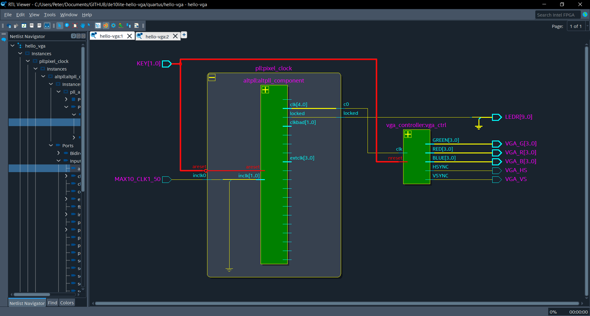

# Intel/Altera Quartus Dark Mode Windows

A script to convert the Intel Quartus IDE to dark mode using [QDarkStyleSheet](https://github.com/ColinDuquesnoy/QDarkStyleSheet) with some modifications.

This script automatically copies the resources and creates shortcuts to ensure every operation opens Quartus in dark mode. It also patches one issue with the base QDarkStyleSheet with the Quartus Report view having a white background.

## Usage

- Powershell is installed
- Quartus has been installed and run at least once
- Clone this repository: `git clone https://github.com/peter-tanner/Intel-Quartus-Dark-Mode-Windows.git && cd Intel-Quartus-Dark-Mode-Windows`
- Run `install.ps1` in an administrator powershell prompt
  - requires admin access to i) modify registry entries to change file association to script and ii) copy icons and stylesheet to intel Quartus directory
- Optional: Rename or remove the old shortcut. This depends on your installation (Mine is under `C:\ProgramData\Microsoft\Windows\Start Menu\Programs\Intel FPGA 23.1std.1.993 Lite Edition\Quartus Prime Lite Edition 23.1std.1.993`)
- RTL view: Select custom theme for dark mode colors

## Images

## Attribution

See `LICENSE.md` for
[QDarkStyleSheet](https://github.com/ColinDuquesnoy/QDarkStyleSheet) licenses

## Bugs

- A box used in license setup still has a white background
- The scintilla-based text editor has missing color (transparent) bar in the folding column which appears white. It appears we cannot change this using stylesheets (See [issue: Add a stylesheet for QScintilla](https://github.com/ColinDuquesnoy/QDarkStyleSheet/issues/122))
- Pin planner is gray mode at best because Altera did not design this interface to be styled anything but light mode. Whenever a cell is set, every other cell is reset to a hardcoded white color, and the BGA view has hardcoded black text.
