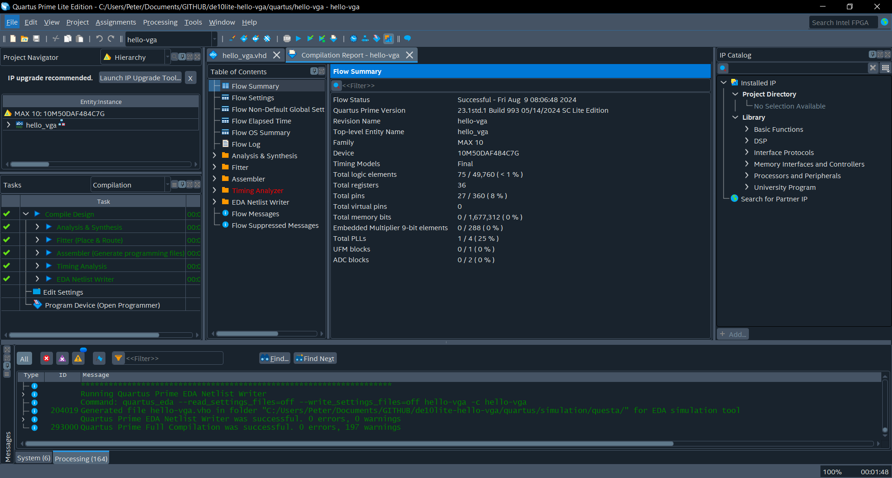

# Intel Quartus Dark Mode Windows

A script to convert the Intel Quartus IDE to dark mode using [QDarkStyleSheet](https://github.com/ColinDuquesnoy/QDarkStyleSheet) with some modifications.

This script automatically copies the resources and creates shortcuts to ensure every operation opens Quartus in dark mode. It also patches one issue with the base QDarkStyleSheet with the Quartus Report view having a white background.

## Usage

- Powershell is installed
- Quartus has been installed and run at least once
- Clone this repository: `git clone https://github.com/peter-tanner/Intel-Quartus-Dark-Mode-Windows.git && cd Intel-Quartus-Dark-Mode-Windows`
- Run `install.ps1` in an administrator powershell prompt
  - requires admin access to i) modify registry entries to change file association to script and ii) copy icons and stylesheet to intel Quartus directory

## Images

## Attribution

See `LICENSE.md` for
[QDarkStyleSheet](https://github.com/ColinDuquesnoy/QDarkStyleSheet) licenses

## Bugs

- The IDE has a white band where the folding tabs are.
- A box used in license setup still has a white background
