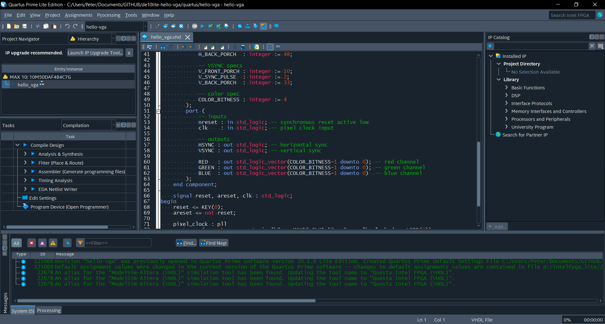

# Intel Quartus Dark Mode Windows

A script to convert the Intel Quartus IDE to dark mode using [QDarkStyleSheet](https://github.com/ColinDuquesnoy/QDarkStyleSheet) with some modifications.

Run `install.ps1` in an admin powershell prompt (requires admin access to i) modify registry entries to change file association to script and ii) copy icons and stylesheet to intel Quartus directory)

## Usage

- Powershell is installed
- Quartus has been installed and run at least once
- Run `install.ps1` in an administrator powershell prompt

## Attribution

See `LICENSE.md` for
[QDarkStyleSheet](https://github.com/ColinDuquesnoy/QDarkStyleSheet) licenses

## Bugs

- The IDE has a white band where the folding tabs are.
- A box used in license setup still has a white background
